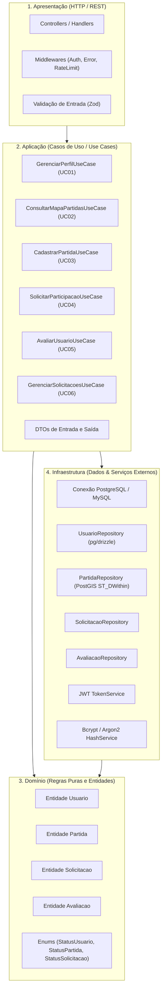

# 01 — Arquitetura de Software e Camadas — Bora! App

## 1. Visão Geral da Arquitetura (Clean Architecture em 4 Camadas)

O backend do **Bora! App** é estruturado seguindo o padrão **Clean Architecture / Onion Architecture**, garantindo total desacoplamento entre regras de negócio corporativas, orquestração de casos de uso, protocolos de comunicação (HTTP) e mecanismos de persistência (Banco de Dados / PostGIS).

---

## 2. Detalhamento de Cada Camada

### 2.1. Camada de Domínio (`src/domain`)
* **Responsabilidade:** Contém a essência das regras de negócio que nunca devem mudar por motivos tecnológicos.
* **Dependências:** **Zero dependências externas** (sem bibliotecas de banco, frameworks web ou ORMs).
* **Componentes:**
  * `Usuario.ts`: Representa o usuário, suas preferências e lógica de recálculo da nota média.
  * `Partida.ts`: Representa uma partida, controle de vagas restantes e validações de horário futuro.
  * `Solicitacao.ts`: Representa o vínculo de interesse entre atleta e partida.
  * `Avaliacao.ts`: Representa a avaliação por estrelas (1 a 5).
  * `Enums`: Estados formais das máquinas de estado (`StatusUsuario`, `StatusPartida`, `StatusSolicitacao`).

### 2.2. Camada de Aplicação (`src/application`)
* **Responsabilidade:** Orquestra os fluxos de trabalho da aplicação (Casos de Uso UC01 a UC06).
* **Componentes:**
  * Cada caso de uso é uma classe com método único `execute(input: InputDTO): Promise<OutputDTO>`.
  * Define as **interfaces de repositórios** (`IUsuarioRepository`, `IPartidaRepository`, etc.), aplicando o Princípio da Inversão de Dependência (DIP - SOLID).

### 2.3. Camada de Infraestrutura (`src/infrastructure`)
* **Responsabilidade:** Implementa a comunicação com o mundo externo (banco de dados, sistema de arquivos, serviços de mapas, filas e bibliotecas de criptografia).
* **Componentes:**
  * `PartidaRepository`: Implementa as consultas geoespaciais com `ST_DWithin` sobre índices `GIST`.
  * `PasswordHashService`: Encapsula `bcrypt` ou `argon2` para não vazar detalhes de hashing para as outras camadas.
  * `TokenService`: Encapsula a emissão e validação de tokens JWT.

### 2.4. Camada de Apresentação (`src/presentation`)
* **Responsabilidade:** Ponto de entrada das requisições HTTP (Fastify ou Express).
* **Componentes:**
  * `Controllers`: Recebem `req`, chamam a validação de schema Zod, invocam o caso de uso correspondente e retornam a resposta HTTP formatada.
  * `Middlewares`: Validação de token JWT, extração do `user_id`, tratamento centralizado de erros e controle de taxa de requisições (*Rate Limiting*).

---

## 3. Fluxo de Execução Padrão (Exemplo: UC02 - Consultar Mapa)

1. **Client (Mobile):** Envia `GET /matches?lat=-20.538&lng=-47.400&radius=5000` com header `Authorization: Bearer <token>`.
2. **Middleware Auth:** Valida a assinatura do token JWT e verifica se `status_usuario === 'Ativo'`.
3. **Controller:** Faz o parse dos parâmetros de query e valida com schema Zod (`lat: number`, `lng: number`, `radius <= 5000`).
4. **Use Case (`ConsultarMapaPartidasUseCase`):**
   * Invoca `IPartidaRepository.findWithinRadius(lat, lng, radius, filters)`.
   * Aplica a **RN02 (LGPD)**: Remove/ofusca a latitude e longitude exata se o usuário autenticado não for o organizador nem um atleta aprovado.
5. **Repository (PostGIS):** Executa `SELECT ... WHERE ST_DWithin(geom, ST_SetSRID(ST_MakePoint($1, $2), 4326)::geography, $3)`.
6. **Controller:** Retorna `HTTP 200 OK` com o array de partidas formatado em JSON.
