# 01 — Arquitetura de Software e Camadas — Bora! App

## 1. Visão Geral da Arquitetura (Clean Architecture em 4 Camadas)

O backend do **Bora! App** é estruturado seguindo o padrão **Clean Architecture / Onion Architecture**, garantindo total desacoplamento entre regras de negócio corporativas, orquestração de casos de uso, protocolos de comunicação (HTTP / WebSockets) e mecanismos de persistência (Banco de Dados PostgreSQL 16 / PostGIS).

```mermaid
graph TD
    subgraph Presentation ["1. Apresentação (HTTP Fastify / WebSockets)"]
        Controllers["Controllers / Handlers REST"]
        WSGateway["WebSocketGateway (Salas de Chat em Tempo Real)"]
        Middlewares["Middlewares (Auth JWT, Error Handler, RateLimit)"]
        Schemas["Validação de Entrada (Zod)"]
    end

    subgraph Application ["2. Aplicação (Casos de Uso / Use Cases UC01 a UC07)"]
        UC1["GerenciarPerfil & Auth (UC01 - CPF Módulo 11 + OTP)"]
        UC2["ConsultarMapaPartidasUseCase (UC02 - PostGIS + RN06)"]
        UC3["CadastrarPartidaUseCase (UC03 - RN04 Precificação/Arbitragem)"]
        UC4["SolicitarParticipacaoUseCase (UC04 - RN01 Anti-conflito + RN06)"]
        UC5["AvaliarAtletaUseCase (UC05 - Reputação Estilo Uber + RN05)"]
        UC6["GerenciarSolicitacoesUseCase (UC06 - Painel Anfitrião)"]
        UC7["ChatMensagemUseCase (UC07 - Mensagens em Tempo Real)"]
        DTOs["DTOs de Entrada e Saída"]
    end

    subgraph Domain ["3. Domínio (Regras Puras e Entidades)"]
        EntUsuario["Entidade Usuario (Validação CPF + Recálculo Nota)"]
        EntPartida["Entidade Partida (RN04 Taxas + RN06 Blindagem)"]
        EntSolicitacao["Entidade Solicitacao"]
        EntAvaliacao["Entidade Avaliacao (1 a 5 Estrelas)"]
        EntChat["Entidade MensagemChat"]
        EntAuditoria["Entidade AuditoriaLog (LGPD)"]
        Enums["Enums (StatusUsuario, StatusPartida, StatusSolicitacao)"]
    end

    subgraph Infrastructure ["4. Infraestrutura (Dados & Serviços Externos)"]
        DBPool["Conexão PostgreSQL 16"]
        RepoUsuario["PgUsuarioRepository"]
        RepoPartida["PgPartidaRepository (PostGIS ST_DWithin)"]
        RepoSolicitacao["PgSolicitacaoRepository"]
        RepoAvaliacao["PgAvaliacaoRepository"]
        RepoChat["PgMensagemChatRepository"]
        RepoAuditoria["PgAuditoriaRepository"]
        TokenService["JWT TokenService"]
        HashService["BcryptPasswordHasher (12 rounds)"]
        WorkerScheduler["MatchSchedulerWorker (Jobs Assíncronos)"]
    end

    Presentation --> Application
    Application --> Domain
    Application --> Infrastructure
    Infrastructure --> Domain
```

---

## 2. Detalhamento de Cada Camada

### 2.1. Camada de Domínio (`src/domain`)
* **Responsabilidade:** Contém a essência das regras de negócio puras que independem de tecnologia ou frameworks.
* **Componentes:**
  * `Usuario.ts`: Representa o atleta/organizador, validação algorítmica de CPF (Módulo 11), dados de equipes amadoras e recálculo dinâmico de nota média.
  * `Partida.ts`: Regras de precificação pública vs privada (RN04), taxas de juiz em amistosos e regra de visibilidade por gênero (RN06).
  * `Solicitacao.ts`: Máquina de estados de solicitação de vagas (`Pendente`, `Em_Analise`, `Aprovada`, `Rejeitada`, `Cancelada`).
  * `Avaliacao.ts`: Avaliação mútua 360° no estilo Uber (notas de 1 a 5 e comentários de conduta).
  * `MensagemChat.ts`: Troca de mensagens instantâneas vinculada a participantes confirmados.
  * `AuditoriaLog.ts`: Trilha imutável de auditoria LGPD com deltas em JSONB.

### 2.2. Camada de Aplicação (`src/application`)
* **Responsabilidade:** Orquestra os Casos de Uso (UC01 a UC07) aplicando as regras de negócio:
  * **UC01:** Cadastro com Trava Dupla (CPF Módulo 11 + OTP de 6 dígitos) e Login Social.
  * **UC02:** Descoberta no Mapa com PostGIS e Blindagem Feminina (RN06).
  * **UC03:** Criação de Partidas Avulsas e Desafios de Amistosos com Taxas RN04.
  * **UC04:** Solicitação de Vagas com Trava Anti-conflito (RN01) e Gênero (RN06).
  * **UC05:** Avaliação Mútua e Suspensão Automática por Reputação (RN05).
  * **UC06:** Painel de Decisão do Anfitrião com Histórico e Estrelas do Solicitante.
  * **UC07:** Troca de Mensagens no Chat da Partida via WebSockets.

### 2.3. Camada de Infraestrutura (`src/infrastructure`)
* **Responsabilidade:** Implementações concretas de repositórios, banco de dados relacional e serviços auxiliares:
  * `PgPartidaRepository`: Consultas geoespaciais com `ST_DWithin` sobre índices `GIST` em coordenadas WGS 84 (SRID 4326).
  * `PgUsuarioRepository`: Persistência de usuários com suporte a Soft Delete (`deletado_em`).
  * `PgAuditoriaRepository`: Gravação de logs de alterações estruturados em JSONB.
  * `BcryptPasswordHasher` & `JwtTokenService`: Criptografia de alta segurança e tokens stateless.

### 2.4. Camada de Apresentação (`src/presentation`)
* **Responsabilidade:** Exposição dos endpoints REST e canais WebSocket:
  * `Controllers`: Validação com schemas Zod, invocação de Use Cases e retorno de DTOs sanitizados.
  * `WebSocketGateway`: Gerenciamento de conexões em tempo real por sala de partida (`match:${partidaId}`).
