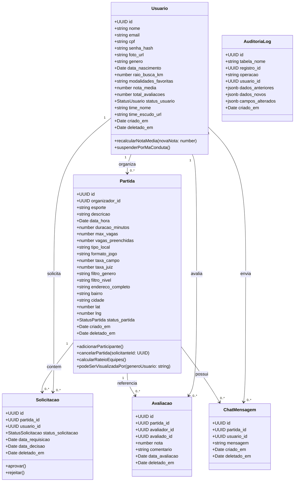

# Artefatos de Engenharia de Software III
## Bora! App — Social Tech de Conexão Esportiva, Reputação Mútua, Gestão de Amistosos & Segurança Feminina
**Faculdade de Tecnologia de Franca "Dr. Thomaz Novelino" — FATEC Franca**  
**Curso Superior de Tecnologia em Análise e Desenvolvimento de Sistemas (ADS)**  
**5º Semestre — Trabalho de Graduação (TG) / Engenharia de Software III (2026)**  

**Autores (Equipe Discente):**
* **Leonardo Pereira** — *Arquitetura de Software, Engenharia de Backend, Modelagem de Dados e Regras de Negócio*
* **Renata Saraiva Claudino** — *Líder de Projeto, Engenharia de Requisitos, Prototipação UI/UX, Design de Interfaces e Identidade Visual*

**Orientação Acadêmica:**
* **Prof. Carlos Eduardo de França Roland** — *FATEC Franca*

---

## 1. Missão, Visão, Valores e Proposta de Valor Social

### 1.1. Missão
Transformar a busca individual por exercício em encontros coletivos e saudáveis, utilizando a tecnologia como ponte para conectar praticantes de esportes e equipes amadoras através da geolocalização. O sistema combate o sedentarismo e o isolamento social, construindo um ambiente seguro e de alta confiança baseado em **reputação mútua e avaliação de conduta (estilo 'Uber do Esporte')** e em **políticas ativas de proteção e segurança feminina no esporte**, oferecendo espaços blindados contra o assédio e a violência contra a mulher.

### 1.2. Visão
Ser a plataforma líder e referência nacional em integração esportiva comunitária, organização de amistosos amadores e inclusão segura de mulheres na prática esportiva no Brasil até 2027, destacando-se pela democratização do esporte, transparência na ocupação de espaços e segurança comunitária.

### 1.3. Proposta de Valor e Diferenciais de Impacto Social
1. **O Modelo 'Uber do Esporte' (Reputação 360°):**
   * O anfitrião da partida avalia o histórico e a **nota média de 1 a 5 estrelas** do atleta solicitante antes de aprovar sua entrada.
   * Após a partida, todos os participantes avaliam mutuamente a pontualidade, respeito e conduta uns dos outros.
2. **Espaço Seguro & Proteção Feminina (Combate à Violência Contra a Mulher):**
   * No Brasil, o receio do assédio, importunação sexual e violência verbal/física afasta milhares de mulheres de quadras e praças esportivas públicas. O Bora! App introduz a regra **RN06 (Espaço Seguro Feminino)**: partidas criadas como exclusivas para mulheres têm **visibilidade restrita no mapa**, de modo que usuários masculinos não conseguem visualizar a localização, o horário nem os participantes do evento, impedindo perseguições, importunação ou comparecimento indevido no local físico.

### 1.4. Valores Corporativos
* **Segurança e Proteção Feminina:** Tolerância zero ao assédio e garantia de ambientes esportivos seguros e acolhedores para mulheres.
* **Comunidade e Espírito Esportivo:** O coletivo, o respeito mútuo e a integração social acima da prática isolada.
* **Inclusão e Acessibilidade:** Esporte democrático para todas as faixas etárias, gêneros e níveis de habilidade (iniciante ao avançado).
* **Confiabilidade e Transparência:** Trava dupla com validação de CPF (Módulo 11), e-mail com OTP de 6 dígitos, gratuidade em locais públicos e divisão justa de despesas em locais privados.

---

## 2. Perguntas e Respostas para Elicitação de Requisitos

Questionário quantitativo e qualitativo aplicado ao público-alvo com recorte especial para práticas seguras e gênero:

1. **Qual é a sua faixa etária?**  
   *Resultado:* Campo aberto com predominância entre 16 e 45 anos.
2. **Quais esportes você pratica ou gostaria de praticar com maior frequência?**  
   *Resultado:* Futebol de Campo, Society, Futsal, Basquete, Vôlei, Futevôlei, Tênis, Beach Tennis e Handebol.
3. **Qual é o principal obstáculo para a prática regular de esportes hoje?**  
   *Resultado:* 64% falta de companhia / time incompleto; 22% falta de horários/quadras; 14% insegurança ao jogar com desconhecidos.
4. **Para mulheres: você já deixou de praticar esportes em locais públicos por medo de assédio ou insegurança?**  
   *Resultado:* **78% das mulheres entrevistadas responderam SIM**. A falta de partidas exclusivas e o medo de importunação são os maiores desestimuladores da prática feminina em praças e quadras abertas.
5. **Você considera indispensável uma funcionalidade de partidas exclusivas para mulheres com mapa oculto para homens?**  
   *Resultado:* **94% de aprovação feminina**. Foi apontada como a funcionalidade mais inovadora e necessária para garantir a integridade física e tranquilidade das jogadoras.
6. **Como você avalia a ideia de um "Uber dos Esportes" (aprovação por nota média de conduta e avaliação pós-jogo)?**  
   *Resultado:* 92% consideram essencial poder avaliar e ver o histórico dos participantes antes de aceitá-los.
7. **Em uma escala de 1 a 5 estrelas, qual a importância da reputação do jogador antes do aceite?**  
   *Resultado:* Média 4.8 / 5.0. Fator decisivo para o anfitrião da partida.
8. **Com que antecedência você costuma planejar suas atividades esportivas?**  
   *Resultado:* 45% procuram no mesmo dia; 35% com 1 a 2 dias; 20% semanalmente.
9. **Qual formato de jogo é mais comum na sua rotina?**  
   *Resultado:* 58% vagas avulsas para completar jogos; 42% desafios de amistosos entre times formados.
10. **Em relação a custos em quadras públicas vs privadas, qual sua expectativa?**  
    *Resultado:* Locais públicos (CEPELs/praças) 100% gratuitos; locais particulares com divisão transparente de aluguel e taxa de arbitragem 50/50 em amistosos.

---

## 3. Matrizes de Análise Estratégica (SWOT e 5W2H)

### 3.1. Matriz SWOT

| FORÇAS (Strengths) | FRAQUEZAS (Weaknesses) |
| :--- | :--- |
| • **Motor Geoespacial Nativo PostGIS:** Consultas de proximidade (`ST_DWithin` com índice GiST < 800ms).<br>• **Proteção e Espaço Seguro Feminino (RN06):** Blindagem geoespacial que oculta partidas femininas para o público masculino.<br>• **Reputação 360° Estilo Uber:** Avaliação mútua pós-jogo e suspensão automática por má conduta (RN05).<br>• **Identidade Verificada:** Trava dupla com CPF (Módulo 11) + OTP de 6 dígitos e Login Social (Google/Apple).<br>• **Suporte Híbrido:** Partidas avulsas e Amistosos estruturados entre equipes.<br>• **Chat em Tempo Real:** Comunicação segura via WebSocket exclusiva para participantes confirmados. | • **Dependência de Efeito de Rede:** Necessidade de alcançar massa crítica de usuárias e usuários em Franca/SP.<br>• **Custos Recorrentes de APIs:** Consumo de serviços de mapas em alta escala.<br>• **Estágio Inicial de Adoção:** Concorrência com o hábito de grupos informais de WhatsApp.<br>• **Equipe Enxuta:** Projeto conduzido em âmbito acadêmico por dois desenvolvedores dedicados. |
| **OPORTUNIDADES (Opportunities)** | **AMEAÇAS (Threats)** |
| • **Políticas Públicas de Incentivo ao Esporte Feminino:** Parcerias com a Prefeitura de Franca, FEAC e coletivos esportivos femininos.<br>• **Integração com +12 CEPELs:** Ocupação organizada e segura de espaços públicos municipais.<br>• **Parcerias Comerciais B2B:** Convênios com arenas de society e quadras privadas para reservas integradas.<br>• **Engajamento Social:** Posicionamento como Social Tech de impacto na segurança pública e bem-estar da mulher. | • **Grupos Informais Orgânicos:** Práticas gratuitas via WhatsApp, porém desprovidas de segurança e verificação.<br>• **Concorrentes Globais:** Expansão de aplicativos internacionais de esporte.<br>• **Riscos Regulatórios (LGPD):** Necessidade de rigor absoluto no tratamento de dados de gênero e geolocalização. |

### 3.2. Matriz 5W2H

| Diretriz | Detalhamento no Projeto Bora! App |
| :--- | :--- |
| **What (O quê?)** | Plataforma multiplataforma de conexão esportiva por geolocalização, com reputação estilo Uber, espaço seguro para mulheres e agendamento de amistosos entre times. |
| **Why (Por quê?)** | Combater o sedentarismo e a violência/assédio contra a mulher no esporte amador, oferecendo ambientes verificados, justos e avaliados pela comunidade. |
| **Who (Quem?)** | Leonardo Pereira e Renata Saraiva Claudino (Alunos do 5º Semestre ADS - FATEC Franca), sob orientação do Prof. Carlos Roland. |
| **Where (Onde?)** | Lançamento em Franca/SP (CEPELs e quadras privadas), com arquitetura em nuvem escalável para todo o território nacional. |
| **When (Quando?)** | Concepção, modelagem, desenvolvimento dos 3 CRUDs, testes e defesa de TG no ano letivo de 2026. |
| **How (Como?)** | Backend RESTful em Node.js com TypeScript e Fastify (Clean Architecture em 4 Camadas), PostgreSQL 16 + PostGIS, frontend React + Material UI, WebSockets e Docker. |
| **How Much (Quanto?)** | Estimativa de 250 horas de engenharia (R$ 20.000,00) e infraestrutura cloud de ~R$ 450,00/mês. |

---

## 4. Modelagem de Processos de Negócio (BPMN)

### Macroprocesso 1: Autenticação e Verificação de Identidade (Módulo 1)
1. Usuário preenche Nome, E-mail, CPF, Gênero e Senha.
2. Sistema executa validação do algoritmo Módulo 11 do CPF e unicidade de e-mail/CPF no banco.
3. Sistema emite código OTP de 6 dígitos enviado por e-mail com validade de 10 minutos.
4. Usuário confirma o código e a conta é ativada (`status_usuario = 'Ativo'`).

### Macroprocesso 2: Descoberta no Mapa e Blindagem Feminina (UC02 / RN02 / RN06)
1. Usuário acessa o mapa. O dispositivo obtém coordenadas GPS e envia requisição espacial ao backend.
2. O backend executa a query PostGIS `ST_DWithin` aplicando a **RN06 (Espaço Seguro Feminino)**:
   * *Se o usuário for Homem:* partidas com `filtro_genero = 'Exclusivo_Feminino'` **são suprimidas da consulta** (não aparecem nem o pino nem os dados).
   * *Se o usuário for Mulher:* todas as partidas mistas e exclusivas femininas são exibidas.
3. O sistema aplica a **RN02 (LGPD)**: o endereço exato fica ofuscado até o aceite formal pelo organizador.

### Macroprocesso 3: Solicitação de Vaga e Decisão do Anfitrião (UC04 / UC06)
1. Atleta solicita vaga. O sistema valida a **RN01 (Anti-conflito de agenda de $\pm 2$h)** e a **RN06 (Restrição de Gênero)**.
2. O anfitrião recebe notificação em tempo real e visualiza o perfil, foto e a **nota média de 1 a 5 estrelas** do solicitante.
3. Se aceito: as vagas preenchidas são incrementadas, o atleta recebe a rota exata (RN02) e entra na sala de **Chat em Tempo Real**.

### Macroprocesso 4: Pós-Jogo e Avaliação Mútua 360° (UC05 / RN05)
1. A partida é finalizada (manual ou automaticamente pelo `MatchSchedulerWorker`).
2. Todos os participantes recebem notificação para avaliar mutuamente os colegas.
3. Atletas atribuem notas de 1 a 5 estrelas e comentários de respeito e disciplina.
4. Job assíncrono recalcula a `nota_media`. Atletas com $\ge 5$ avaliações e média $< 2.0$ são suspensos automaticamente (**RN05**).

---

## 5. Requisitos do Sistema e Regras de Negócio

### 5.1. Requisitos Funcionais (RF)

* **RF01 (Cadastro com Trava Dupla):** Cadastrar usuários com validação estrita de CPF (algoritmo Módulo 11), unicidade de e-mail e hash Bcrypt.
* **RF02 (Confirmação OTP):** Validar conta de usuário via código de verificação OTP de 6 dígitos com expiração de 10 minutos.
* **RF03 (Login Social):** Permitir autenticação rápida e segura com Google Identity e Apple ID.
* **RF04 (Busca Espacial PostGIS):** Plotar partidas no mapa interativo dentro do raio de 1 a 30 km configurado pelo usuário.
* **RF05 (Filtro e Proteção Feminina):** Permitir filtro por "Exclusivo Feminino" com blindagem de visualização para homens (RN06).
* **RF06 (Formatos de Confronto):** Gerenciar partidas avulsas individuais e desafios de amistosos entre equipes formadas.
* **RF07 (Precificação e Arbitragem — RN04):** Garantir gratuidade em quadras públicas e divisão 50/50 de taxas em amistosos.
* **RF08 (Ciclo de Vida da Partida):** Gerenciar status (`Rascunho`, `Publicada`, `Lotada`, `Em_Andamento`, `Finalizada`, `Cancelada`).
* **RF09 (Painel de Decisão do Dono):** Exibir perfil e nota média de conduta do solicitante para aprovação pelo anfitrião (estilo Uber).
* **RF10 (Chat em Tempo Real):** Disponibilizar canal de mensagens via WebSocket exclusivo para os participantes confirmados.
* **RF11 (Avaliação Mútua 360°):** Permitir que todos os participantes que jogaram a partida se avaliem mutuamente com notas de 1 a 5 estrelas.
* **RF12 (Auditoria e Soft Delete):** Registrar logs imutáveis de auditoria com deltas JSONB e exclusão lógica em todas as tabelas.

### 5.2. Requisitos Não-Funcionais (RNF)

* **RNF01 (Multiplataforma):** Interface responsiva em React + Material UI otimizada para web e dispositivos móveis.
* **RNF02 (Privacidade e Segurança da Mulher — Safety by Design):** Endereços exatos só são revelados após aceite e partidas femininas são invisíveis para o público masculino.
* **RNF03 (Performance PostGIS):** Consultas espaciais (`ST_DWithin` com índice GiST) com tempo de resposta $< 800$ ms no P95.
* **RNF04 (Segurança Criptográfica):** Hashing de senhas com Bcrypt (10+ salt rounds) e autenticação JWT stateless.
* **RNF05 (Baixa Latência):** Mensagens do chat via WebSocket com latência de entrega $< 200$ ms.

### 5.3. Regras de Negócio Fundamentais (RN)

* **RN01 — Prevenção de Conflito de Agenda:** Proíbe inscrição ou aprovação de um mesmo atleta em partidas com sobreposição de horário dentro de $\pm 2$ horas.
* **RN02 — Privacidade Espacial (LGPD):** Coordenadas exatas e rota GPS permanecem ofuscadas na busca pública até a aprovação formal do atleta.
* **RN03 — Trava de Cancelamento em Partidas Lotadas:** O anfitrião não pode cancelar diretamente partidas no estado `Lotada`, exigindo chamado de suporte.
* **RN04 — Precificação de Espaços e Taxa de Arbitragem:**
  * *Locais Públicos (CEPELs/Praças):* Taxa de campo = R$ 0,00 (Gratuito).
  * *Locais Privados:* Permite taxa de quadra rateada entre os atletas/times.
  * *Taxa de Juiz:* Exclusiva para Amistosos entre Equipes, dividida automaticamente em 50% mandante e 50% visitante.
* **RN05 — Moderação Automática por Reputação:** Usuários com 5 ou mais avaliações acumuladas cuja nota média for inferior a 2.00 estrelas são suspensos automaticamente pelo sistema.
* **RN06 — Espaço Seguro & Exclusividade Feminina (Combate à Violência Contra a Mulher):**
  * Partidas criadas com `filtro_genero = 'Exclusivo_Feminino'` são **completamente invisíveis no mapa e nas buscas para usuários cadastrados como do gênero masculino**.
  * Usuários masculinos são estritamente impedidos pelo backend de visualizar, solicitar vaga ou interagir em partidas exclusivas para mulheres.

---

## 6. Estrutura Analítica do Projeto (EAP)

```
1. Bora! App — Social Tech
├── 1.1. Gerenciamento do Projeto
│   ├── 1.1.1. Termo de Abertura do Projeto (TAP)
│   ├── 1.1.2. Governança e Matriz de Riscos (gemini.md)
│   └── 1.1.3. Acompanhamento de Marcos e Sprints
├── 1.2. Engenharia de Requisitos e Modelagem
│   ├── 1.2.1. Elicitação com Recorte de Segurança Feminina
│   ├── 1.2.2. Modelagem de Processos BPMN
│   ├── 1.2.3. Especificação de Requisitos (RF01 a RF12, RNF01 a RNF05, RN01 a RN06)
│   └── 1.2.4. Modelagem UML (Casos de Uso, Classes, Sequência, Estados)
├── 1.3. Design de Interface (UI/UX)
│   ├── 1.3.1. Identidade Visual (Azul #0066FF e Destaque #FFD700)
│   ├── 1.3.2. Rabiscoframes, Wireframes e Protótipo Hi-Fi
│   └── 1.3.3. Design System com Material UI e Acessibilidade (WCAG)
├── 1.4. Desenvolvimento de Software (Clean Architecture)
│   ├── 1.4.1. Camada de Domínio (Entidades Puras e Regras de Reputação e Gênero)
│   ├── 1.4.2. Camada de Aplicação (Use Cases dos 3 CRUDs + Módulos de Segurança)
│   ├── 1.4.3. Camada de Apresentação (API Fastify, JWT, Zod e WebSockets)
│   ├── 1.4.4. Camada de Infraestrutura (PostgreSQL 16 + PostGIS GiST e Docker)
│   └── 1.4.5. Frontend Client SPA (React, TypeScript, Vite e MUI)
└── 1.5. Qualidade, Testes e Homologação
    ├── 1.5.1. Testes Unitários de Regras de Negócio e RN06 (Jest)
    ├── 1.5.2. Testes de Integração Geoespacial (ST_DWithin)
    └── 1.5.3. Checklist de Homologação e Defesa de TG
```

---

## 7. Termo de Abertura do Projeto (TAP)

* **Título do Projeto:** Bora! App — Conexão Esportiva, Reputação Mútua, Gestão de Amistosos e Segurança Feminina
* **Contexto:** Trabalho de Graduação (TG) — 5º Semestre de Análise e Desenvolvimento de Sistemas (FATEC Franca).
* **Equipe Executora:** Leonardo Pereira e Renata Saraiva Claudino.
* **Orientador:** Prof. Carlos Eduardo de França Roland.
* **Justificativa:** Social Tech de impacto que resolve o sedentarismo e a falta de quórum esportivo, trazendo duas inovações fundamentais: a reputação mútua no estilo Uber e a blindagem geoespacial para mulheres, criando um ambiente seguro contra assédio e violência.
* **Premissas:** Arquitetura limpa em 4 camadas, suporte nativo a operações geoespaciais com PostGIS e conformidade rigorosa com a LGPD.
* **Restrições:** Orçamento acadêmico com lançamento inicial em Franca/SP e cronograma balizado pelo ano letivo de 2026.

---

## 8. Especificação Detalhada dos Casos de Uso (UC01 a UC07)

### UC01 — Gerenciar Perfil e Autenticação com Trava Dupla
* **Atores:** Jogador, Organizador.
* **Pré-condição:** Nenhuma (cadastro) ou Usuário logado (edição).
* **Fluxo Principal:**
  1. Usuário informa Nome, E-mail, CPF, Gênero, Data de Nascimento e Senha.
  2. Sistema valida CPF pelo Módulo 11 e verifica unicidade no banco.
  3. Sistema emite código OTP de 6 dígitos para o e-mail informado.
  4. Usuário valida o código e personaliza foto, modalidades favoritas, raio de busca padrão e dados da equipe.
* **Fluxo de Exceção:** CPF inválido ou e-mail duplicado bloqueia a operação imediatamente.

### UC02 — Consultar Mapa de Partidas e Amistosos
* **Atores:** Jogador, Organizador, API de Mapas.
* **Pré-condição:** Usuário autenticado com GPS ativo.
* **Fluxo Principal:**
  1. Usuário acessa o mapa.
  2. Sistema captura coordenadas GPS e executa query PostGIS `ST_DWithin`.
  3. **Aplicação da RN06:** Se o usuário autenticado for Homem, o backend filtra e remove todas as partidas com `filtro_genero = 'Exclusivo_Feminino'`. Se for Mulher, exibe partidas mistas e femininas.
  4. Usuário clica no card do evento e visualiza horário, vagas restantes e a **nota média de conduta do anfitrião**.
* **Pós-condição:** Partidas disponíveis exibidas com endereço exato protegido pela RN02.

### UC03 — Cadastrar Partida ou Desafio de Amistoso
* **Atores:** Organizador / Capitão da Equipe.
* **Pré-condição:** Usuário autenticado no estado Ativo.
* **Fluxo Principal:**
  1. Organizador seleciona "Criar Partida".
  2. Define esporte, formato (Avulso vs Amistoso), data, hora, duração estimada e número de vagas.
  3. Define o filtro de visibilidade: Misto ou **Exclusivo para Mulheres (Espaço Seguro)**.
  4. Seleciona o local no mapa (coordenadas GPS de alta precisão).
  5. Aplica regras da RN04 (público = gratuito, privado = aluguel).
  6. Sistema valida os dados e grava a partida como `Publicada`.

### UC04 — Solicitar Participação em Partida
* **Atores:** Jogador interessado.
* **Pré-condição:** Usuário ativo e partida com vagas abertas.
* **Fluxo Principal:**
  1. Jogador clica em "Solicitar Vaga".
  2. Sistema valida a **RN01 (Anti-conflito de horário de $\pm 2$h)** e a **RN06 (Restrição de Gênero)**.
  3. Sistema grava solicitação como `Pendente` e notifica o organizador em tempo real.
* **Fluxo de Exceção:** Homem tentando solicitar vaga em partida feminina ou conflito de horário bloqueia a ação com alerta específico.

### UC05 — Avaliar Atletas e Reputação Mútua (Estilo Uber)
* **Atores:** Todos os participantes da partida concluída.
* **Pré-condição:** Partida no estado `Finalizada`.
* **Fluxo Principal:**
  1. Ao término do jogo, o sistema abre a lista de atletas que participaram da partida.
  2. O usuário atribui nota de 1 a 5 estrelas e comentários de respeito, disciplina e pontualidade.
  3. Sistema grava a avaliação e recalcula assincronamente a `nota_media` do atleta avaliado.
  4. **Aplicação da RN05:** Se a média for inferior a 2.0 (com $\ge 5$ avaliações), suspende a conta automaticamente.

### UC06 — Gerenciar Solicitações de Vagas (Painel do Anfitrião)
* **Atores:** Organizador da Partida.
* **Pré-condição:** Partida com solicitações pendentes.
* **Fluxo Principal:**
  1. Organizador abre o painel de solicitações.
  2. Visualiza foto, modalidades e a **nota média de conduta de 1 a 5 estrelas do atleta**.
  3. Clica em "Aceitar" ou "Recusar".
  4. Ao aceitar: a vaga é confirmada, o atleta recebe rota GPS exata (RN02) e entra no Chat da Partida.

### UC07 — Interagir no Chat da Partida em Tempo Real
* **Atores:** Organizador e Atletas Aprovados.
* **Pré-condição:** Usuário confirmado na partida.
* **Fluxo Principal:**
  1. Participante acessa a sala de chat da partida via conexão WebSocket dedicada.
  2. Troca mensagens instantâneas de alinhamento de uniforme, horários e caronas.

---

## 9. Diagrama de Classes e Entidades de Domínio



---

## 10. Modelagem de Dados: MER (Conceitual) e DER (Lógico/Físico)

### 10.1. MER — Modelo Entidade-Relacionamento (Conceitual)

* **USUARIO (1,N) $\rightarrow$ organiza $\rightarrow$ PARTIDA (0,N):** Um usuário pode organizar diversas partidas ou amistosos.
* **USUARIO (1,N) $\rightarrow$ solicita $\rightarrow$ SOLICITACAO (0,N):** Atletas solicitam vagas avulsas ou amistosos.
* **PARTIDA (1,N) $\rightarrow$ contem $\rightarrow$ SOLICITACAO (0,N):** Cada partida centraliza solicitações pendentes e aprovadas.
* **USUARIO (1,N) $\rightarrow$ avalia $\rightarrow$ AVALIACAO (0,N):** Relação 360° onde participantes avaliam a conduta uns dos outros.
* **PARTIDA (1,N) $\rightarrow$ possui $\rightarrow$ CHAT_MENSAGEM (0,N):** Mensagens em tempo real vinculadas à sala da partida.
* **USUARIO (1,N) $\rightarrow$ valida $\rightarrow$ CODIGO_VERIFICACAO_EMAIL (0,N):** Códigos OTP temporários de 6 dígitos.
* **USUARIO (0,N) $\rightarrow$ gera $\rightarrow$ AUDITORIA_LOG (1,1):** Trilha imutável de alterações LGPD.

---

### 10.2. DER — Script DDL Físico Completo (PostgreSQL 16 + PostGIS)

```sql
-- 1. Extensões e Tipos Enumerados
CREATE EXTENSION IF NOT EXISTS "uuid-ossp";
CREATE EXTENSION IF NOT EXISTS postgis;

CREATE TYPE tipo_status_usuario AS ENUM ('Pendente_Validacao', 'Ativo', 'Suspenso', 'Banido');
CREATE TYPE tipo_status_partida AS ENUM ('Rascunho', 'Publicada', 'Lotada', 'Em_Andamento', 'Finalizada', 'Cancelada');
CREATE TYPE tipo_status_solicitacao AS ENUM ('Pendente', 'Em_Analise', 'Aprovada', 'Rejeitada', 'Cancelada');

-- 2. Tabela de Usuários (Trava Dupla CPF + E-mail e Soft Delete)
CREATE TABLE usuario (
    id UUID PRIMARY KEY DEFAULT uuid_generate_v4(),
    nome VARCHAR(150) NOT NULL,
    email VARCHAR(255) UNIQUE NOT NULL,
    cpf VARCHAR(14) UNIQUE NULL,
    senha_hash VARCHAR(255) NOT NULL,
    foto_url TEXT NULL,
    genero VARCHAR(50) NOT NULL,
    data_nascimento DATE NOT NULL,
    raio_busca_km INTEGER DEFAULT 5 NOT NULL CHECK (raio_busca_km BETWEEN 1 AND 30),
    modalidades_favoritas VARCHAR(255),
    nota_media DECIMAL(3,2) DEFAULT 5.00 NOT NULL,
    total_avaliacoes INTEGER DEFAULT 0 NOT NULL,
    status_usuario tipo_status_usuario DEFAULT 'Pendente_Validacao' NOT NULL,
    time_nome VARCHAR(100) NULL,
    time_escudo_url TEXT NULL,
    time_bairro VARCHAR(100) NULL,
    time_modalidade VARCHAR(80) NULL,
    criado_em TIMESTAMP WITH TIME ZONE DEFAULT NOW() NOT NULL,
    atualizado_em TIMESTAMP WITH TIME ZONE DEFAULT NOW() NOT NULL,
    deletado_em TIMESTAMP WITH TIME ZONE NULL,
    deletado_por_id UUID NULL REFERENCES usuario(id)
);

CREATE INDEX idx_usuario_email_ativo ON usuario(email) WHERE deletado_em IS NULL;
CREATE INDEX idx_usuario_cpf_ativo ON usuario(cpf) WHERE deletado_em IS NULL AND cpf IS NOT NULL;
CREATE INDEX idx_usuario_status ON usuario(status_usuario);

-- 3. Tabela de Códigos OTP de Verificação de E-mail
CREATE TABLE codigo_verificacao_email (
    id UUID PRIMARY KEY DEFAULT uuid_generate_v4(),
    email VARCHAR(255) NOT NULL,
    codigo VARCHAR(6) NOT NULL,
    expira_em TIMESTAMP WITH TIME ZONE NOT NULL,
    utilizado BOOLEAN DEFAULT FALSE NOT NULL,
    criado_em TIMESTAMP WITH TIME ZONE DEFAULT NOW() NOT NULL
);

CREATE INDEX idx_codigo_otp_ativo ON codigo_verificacao_email(email, codigo, expira_em) WHERE utilizado = FALSE;

-- 4. Tabela de Partidas & Amistosos (PostGIS + RN04 Precificação + RN06 Proteção Feminina)
CREATE TABLE partida (
    id UUID PRIMARY KEY DEFAULT uuid_generate_v4(),
    organizador_id UUID NOT NULL REFERENCES usuario(id) ON DELETE CASCADE,
    esporte VARCHAR(80) NOT NULL,
    descricao TEXT,
    data_hora TIMESTAMP WITH TIME ZONE NOT NULL,
    duracao_minutos INTEGER DEFAULT 90 NOT NULL,
    max_vagas INTEGER NOT NULL CHECK (max_vagas > 1),
    vagas_preenchidas INTEGER DEFAULT 0 NOT NULL CHECK (vagas_preenchidas <= max_vagas),
    tipo_local VARCHAR(20) DEFAULT 'Publica' NOT NULL CHECK (tipo_local IN ('Publica', 'Privada')),
    formato_jogo VARCHAR(30) DEFAULT 'Avulso' NOT NULL CHECK (formato_jogo IN ('Avulso', 'Amistoso_Times')),
    taxa_campo DECIMAL(10,2) DEFAULT 0.00 NOT NULL,
    taxa_juiz DECIMAL(10,2) DEFAULT 0.00 NOT NULL,
    filtro_genero VARCHAR(50) DEFAULT 'Misto' NOT NULL, -- 'Misto' ou 'Exclusivo_Feminino' (RN06)
    filtro_nivel VARCHAR(50),
    endereco_completo VARCHAR(300) NOT NULL,
    bairro VARCHAR(100) NOT NULL,
    cidade VARCHAR(100) DEFAULT 'Franca' NOT NULL,
    lat DECIMAL(10,7) NOT NULL,
    lng DECIMAL(10,7) NOT NULL,
    geom GEOMETRY(Point, 4326),
    status_partida tipo_status_partida DEFAULT 'Publicada' NOT NULL,
    criado_em TIMESTAMP WITH TIME ZONE DEFAULT NOW() NOT NULL,
    atualizado_em TIMESTAMP WITH TIME ZONE DEFAULT NOW() NOT NULL,
    deletado_em TIMESTAMP WITH TIME ZONE NULL,
    deletado_por_id UUID NULL REFERENCES usuario(id)
);

CREATE INDEX idx_partida_geom_gist ON partida USING GIST(geom);
CREATE INDEX idx_partida_status_data ON partida(status_partida, data_hora) WHERE deletado_em IS NULL;
CREATE INDEX idx_partida_genero ON partida(filtro_genero);

-- 5. Tabela de Solicitações de Vagas / Amistosos
CREATE TABLE solicitacao (
    id UUID PRIMARY KEY DEFAULT uuid_generate_v4(),
    partida_id UUID NOT NULL REFERENCES partida(id) ON DELETE CASCADE,
    usuario_id UUID NOT NULL REFERENCES usuario(id) ON DELETE CASCADE,
    status_solicitacao tipo_status_solicitacao DEFAULT 'Pendente' NOT NULL,
    data_requisicao TIMESTAMP WITH TIME ZONE DEFAULT NOW() NOT NULL,
    data_decisao TIMESTAMP WITH TIME ZONE NULL,
    deletado_em TIMESTAMP WITH TIME ZONE NULL,
    deletado_por_id UUID NULL REFERENCES usuario(id),
    CONSTRAINT uq_usuario_partida UNIQUE (partida_id, usuario_id)
);

CREATE INDEX idx_solicitacao_partida ON solicitacao(partida_id, status_solicitacao) WHERE deletado_em IS NULL;
CREATE INDEX idx_solicitacao_usuario ON solicitacao(usuario_id);

-- 6. Tabela de Avaliações Mútuas Pós-Jogo (Estilo Uber)
CREATE TABLE avaliacao (
    id UUID PRIMARY KEY DEFAULT uuid_generate_v4(),
    partida_id UUID NOT NULL REFERENCES partida(id) ON DELETE CASCADE,
    avaliador_id UUID NOT NULL REFERENCES usuario(id) ON DELETE CASCADE,
    avaliado_id UUID NOT NULL REFERENCES usuario(id) ON DELETE CASCADE,
    nota INTEGER NOT NULL CHECK (nota BETWEEN 1 AND 5),
    comentario TEXT NULL,
    data_avaliacao TIMESTAMP WITH TIME ZONE DEFAULT NOW() NOT NULL,
    deletado_em TIMESTAMP WITH TIME ZONE NULL,
    deletado_por_id UUID NULL REFERENCES usuario(id),
    CONSTRAINT uq_avaliacao_partida_par UNIQUE (partida_id, avaliador_id, avaliado_id)
);

CREATE INDEX idx_avaliacao_avaliado ON avaliacao(avaliado_id);

-- 7. Tabela de Mensagens de Chat da Partida (WebSocket)
CREATE TABLE chat_mensagem (
    id UUID PRIMARY KEY DEFAULT uuid_generate_v4(),
    partida_id UUID NOT NULL REFERENCES partida(id) ON DELETE CASCADE,
    usuario_id UUID NOT NULL REFERENCES usuario(id) ON DELETE CASCADE,
    mensagem TEXT NOT NULL,
    criado_em TIMESTAMP WITH TIME ZONE DEFAULT NOW() NOT NULL,
    deletado_em TIMESTAMP WITH TIME ZONE NULL,
    deletado_por_id UUID NULL REFERENCES usuario(id)
);

CREATE INDEX idx_chat_partida_data ON chat_mensagem(partida_id, criado_em ASC) WHERE deletado_em IS NULL;

-- 8. Tabela de Log de Auditoria Imutável (LGPD)
CREATE TABLE auditoria_log (
    id UUID PRIMARY KEY DEFAULT uuid_generate_v4(),
    tabela_nome VARCHAR(100) NOT NULL,
    registro_id UUID NOT NULL,
    operacao VARCHAR(20) NOT NULL CHECK (operacao IN ('INSERT', 'UPDATE', 'DELETE', 'SOFT_DELETE')),
    usuario_id UUID NULL,
    dados_anteriores JSONB NULL,
    dados_novos JSONB NULL,
    campos_alterados JSONB NULL,
    criado_em TIMESTAMP WITH TIME ZONE DEFAULT NOW() NOT NULL
);

CREATE INDEX idx_auditoria_tabela_reg ON auditoria_log(tabela_nome, registro_id);
CREATE INDEX idx_auditoria_criado_em ON auditoria_log(criado_em DESC);
```

### 10.3. Query Geoespacial Principal com Blindagem Feminina (RN06)
```sql
SELECT 
    p.id,
    p.esporte,
    p.descricao,
    p.data_hora,
    p.duracao_minutos,
    p.max_vagas,
    p.vagas_preenchidas,
    p.tipo_local,
    p.formato_jogo,
    p.taxa_campo,
    p.taxa_juiz,
    p.filtro_genero,
    p.bairro,
    p.cidade,
    ST_Distance(p.geom, ST_SetSRID(ST_MakePoint(:user_lng, :user_lat), 4326)::geography) AS distancia_metros,
    u.id AS organizador_id,
    u.nome AS organizador_nome,
    u.nota_media AS organizador_nota
FROM partida p
INNER JOIN usuario u ON p.organizador_id = u.id
WHERE p.status_partida = 'Publicada'
  AND p.deletado_em IS NULL
  AND p.data_hora > NOW()
  AND ST_DWithin(p.geom, ST_SetSRID(ST_MakePoint(:user_lng, :user_lat), 4326)::geography, :raio_metros)
  -- REGRA RN06: Blindagem Feminina (Homens não enxergam partidas exclusivas para mulheres)
  AND (
      p.filtro_genero = 'Misto'
      OR (p.filtro_genero = 'Exclusivo_Feminino' AND :genero_usuario = 'Feminino')
  )
ORDER BY distancia_metros ASC;
```

---

## 11. Matrizes de Rastreabilidade

### 11.1. Matriz A: Requisitos Funcionais $\times$ Regras de Negócio
| Requisito Funcional | RN01 (Anti-conflito) | RN02 (LGPD Espacial) | RN03 (Lock Lotada) | RN04 (Precificação) | RN05 (Moderação) | RN06 (Segurança Mulher) |
| :--- | :---: | :---: | :---: | :---: | :---: | :---: |
| **RF04 (Mapa PostGIS)** | | **X** | | | | **X** |
| **RF05 (Filtro Feminino)** | | **X** | | | | **X** |
| **RF06 (Amistosos / Vagas)** | | | | **X** | | |
| **RF07 (Precificação / Taxas)** | | | | **X** | | |
| **RF08 (Status da Partida)** | | | **X** | | | |
| **RF09 (Painel Anfitrião)** | | | | | **X** | |
| **RF10 (Chat WebSocket)** | | **X** | | | | **X** |
| **RF11 (Avaliação 360°)** | | | | | **X** | |

### 11.2. Matriz B: Requisitos Funcionais $\times$ Casos de Uso
| Requisito Funcional | UC01 | UC02 | UC03 | UC04 | UC05 | UC06 | UC07 |
| :--- | :---: | :---: | :---: | :---: | :---: | :---: | :---: |
| **RF01 a RF03 (Auth/OTP/Social)** | **X** | | | | | | |
| **RF04/RF05 (Mapa/Filtro Mulher)** | | **X** | | | | | |
| **RF06/RF07 (Criação/Amistoso/Taxas)** | | | **X** | | | | |
| **RF08/RF09 (Solicitação/Aceite)** | | | | **X** | | **X** | |
| **RF10 (Chat WebSocket)** | | | | | | | **X** |
| **RF11 (Avaliação Estilo Uber)** | | | | | **X** | | |
| **RF12 (Auditoria e Soft Delete)** | **X** | | **X** | **X** | **X** | **X** | **X** |

---

## 12. Arquitetura de Software e Padrões de Projeto

A arquitetura do Bora! App adota a **Clean Architecture em 4 Camadas** com Inversão de Dependência (DIP):
1. **Camada de Apresentação (`src/presentation`):** Controladores REST Fastify, Schemas Zod, Middlewares de Autenticação JWT, Rate Limiting e Gateway de WebSockets.
2. **Camada de Aplicação (`src/application`):** Casos de Uso (`AutenticarUsuarioUseCase`, `CriarPartidaUseCase`, `AvaliarAtletaUseCase`, `EnviarMensagemChatUseCase`) e contratos de repositório (`IRepositories.ts`).
3. **Camada de Domínio (`src/domain`):** Entidades puras de negócio (`Usuario`, `Partida`, `Solicitacao`, `Avaliacao`, `MensagemChat`, `AuditoriaLog`), regras de recálculo de nota média, RN04 e RN06.
4. **Camada de Infraestrutura (`src/infrastructure`):** Implementações PostgreSQL com PostGIS (`PgPartidaRepository`, `PgUsuarioRepository`), segurança Bcrypt, tokens JWT e agendador assíncrono `MatchSchedulerWorker`.

---

## 13. Histórico de Versões e Controle de Mudanças

| Versão | Data | Principais Modificações e Evoluções |
| :---: | :---: | :--- |
| **v5.0** | 19/08/2026 | Especificação preliminar com 6 Casos de Uso básicos e modelagem inicial. |
| **v7.0** | 20/08/2026 | Padronização snake_case, trava RN03 de cancelamento em partidas lotadas e protótipos Hi-Fi. |
| **v8.0** | 24/08/2026 | Inclusão de Amistosos entre Equipes, autenticação com trava de CPF (Módulo 11) + OTP, Chat WebSocket, Soft Delete e Auditoria Log. |
| **v8.1 (Atual)** | 27/08/2026 | **Versão Oficial Consolidada de Engenharia de Software III (TG):**<br>• Formalização da **RN06 (Espaço Seguro Feminino)**: combate à violência contra a mulher com blindagem geoespacial que oculta partidas femininas para homens.<br>• Modelagem completa MER (Conceitual) e DER (Lógico/Físico) de 7 tabelas com query geoespacial de proteção de gênero.<br>• Alinhamento do conceito central de **Reputação Mútua Estilo Uber** e avaliação 360°.<br>• Autores: **Leonardo Pereira** e **Renata Saraiva Claudino** (5º Semestre ADS - FATEC Franca). |
